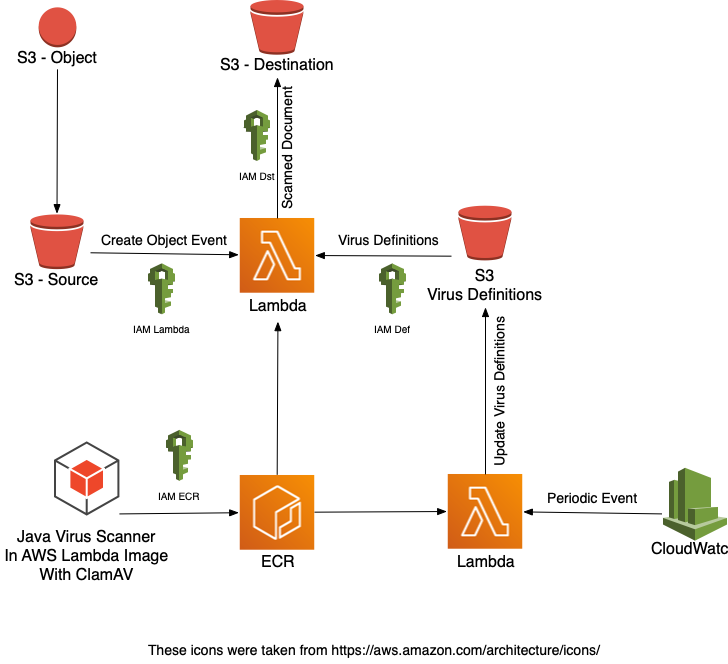

### App to scan files on S3 with ClamAV virus scanner using AWS Lambda deployed in Docker Container

#### Build image
```
mvn clean compile dependency:copy-dependencies -DincludeScope=runtime
docker build -t clamav-lambda .
```
#### Run local
```
docker run -e s3dstSecretKey=$s3dstSecretKey -e s3dstAccessKey=$s3dstAccessKey --name=lambda -p 9009:8080 clamav-lambda biz.cits.clamav.lambda.handler.Update
curl -XPOST "http://localhost:9009/2015-03-31/functions/function/invocations" -d '{"task":"update"}'
docker cp src/test/resources/eicar/ lambda:/var/task/eicar
curl -XPOST "http://localhost:9009/2015-03-31/functions/function/invocations" -d '{"task":"scan", "file":"eicar"}'
```
#### Push to AWS
```
aws --region us-east-1 ecr get-login-password | docker login --username AWS --password-stdin 122936777114.dkr.ecr.us-east-1.amazonaws.com/clamav-lambda:latest
docker tag clamav-lambda:latest 122936777114.dkr.ecr.us-east-1.amazonaws.com/clamav-lambda:latest
docker push 122936777114.dkr.ecr.us-east-1.amazonaws.com/clamav-lambda:latest
```

#### Env Variables
```
storeBucket=clamav-out
dstBucket=clamav-out
```
### AWS Cli test for uploading file to S3
```
aws configure
aws s3api list-objects-v2 --bucket clamav-out
aws s3api put-object --bucket clamav-out --key test/test --body /usr/local/bin/aws_completer
```

### Stats
#### Definitions update and upload to S3
###### Duration: 9887.95 ms Billed Duration: 11545 ms Memory Size: 2128 MB Max Memory Used: 433 MB Init Duration: 1656.91 ms
#### Scanning 3MB file from S3 Event using definitions from S3

#### Scanning 3MB file from S3 Event using definitions from EFS
#### Scanning 600MB file from S3 Event using definitions from S3

#### Scanning 600MB file from S3 Event using definitions from EFS